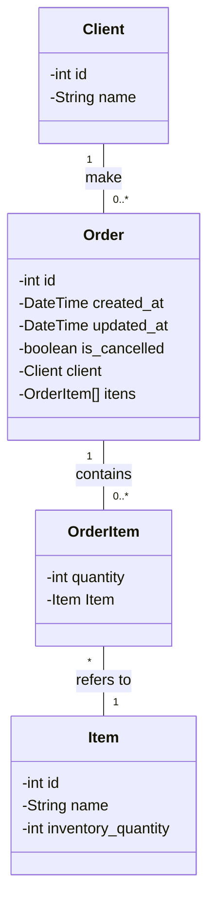

```mermaid
classDiagram
    class Order {
        -int id
        -DateTime created_at
        -DateTime updated_at
        -boolean is_cancelled
        -Client client
        -OrderItem[] itens
    }
    class OrderItem {
        -int quantity
        -Item Item
    }
    class Item {
        -int id
        -String name
        -int inventory_quantity
    }
    class Client {
        -int id
        -String name
    }

    Order "1" -- "0..*" OrderItem : contains
    OrderItem "*" -- "1" Item : refers to
    Client "1" -- "0..*" Order : make
```